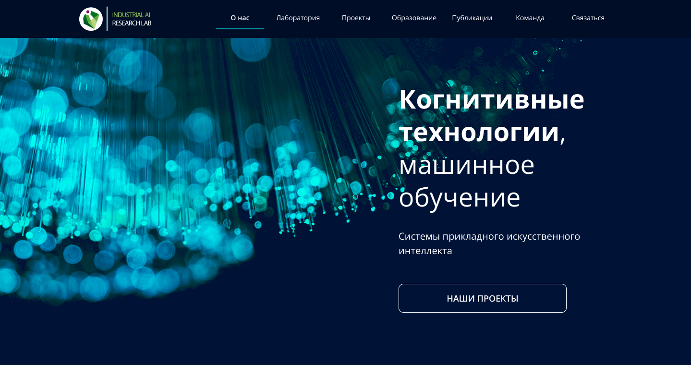

# ITMO-lab

Лаборатория входит в состав Национального центра когнитивных разработок и специализируется на выполнении разных промышленных задач на основе больших данных.

Лендинг ориентирован на будущих студентов и его основная задача — привлечь новых студентов в магистратуру / аспирантуру. Поэтому основная задача — интересно рассказать о Лаборатории.

**Figma**

* [Ссылка на макет в Figma](https://www.figma.com/file/1V8lzi168fbxjb5cm5gVj0/PAGE-SG_ITMO?node-id=0%3A1)

**Trello**

* [Ссылка на доску в Trello](https://trello.com/b/eQZmnSOe/itmo)

**Команда**
- [Булат](https://github.com/XcQuake)
- [Валерий Леонтьев](https://github.com/F4RR311)
- [Владимир Иванча](https://github.com/VladimirIvancha)
- [Мария Кулаковская](https://github.com/Smolib)
- [Ольга Латкина](https://github.com/olgalatkina)
- [Роман Камельянов](https://github.com/kamelyanov)
